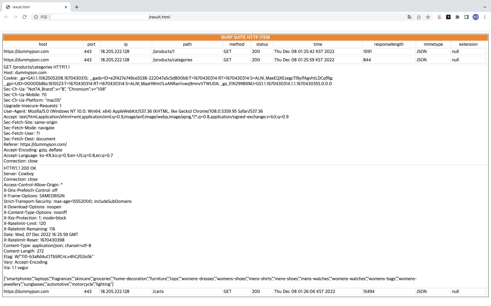

# burpsuite-http-history-xml-convert-html

## Overview
**burpsuite-http-history-xml-convert-html**는 burpsuite의 HTTP HISTORY를 xml 파일을 HTML에서 확인하도록 변환해주는 도구입니다.



## Usage
```bash
# install package
pip install -r requirements.txt

# help
python main.py -h

# xml to html
python main.py -f ./test/test.xml

# open Result HTML
open result.html
```

## 참고
- `template.html`의 위치를 별도로 지정하지 않은 경우, `main.py`와 같은 위치에 존재해야 합니다.
- 결과 html 파일(`result.html`)과 `style.css`는 같은 위치에 존재해야 합니다.